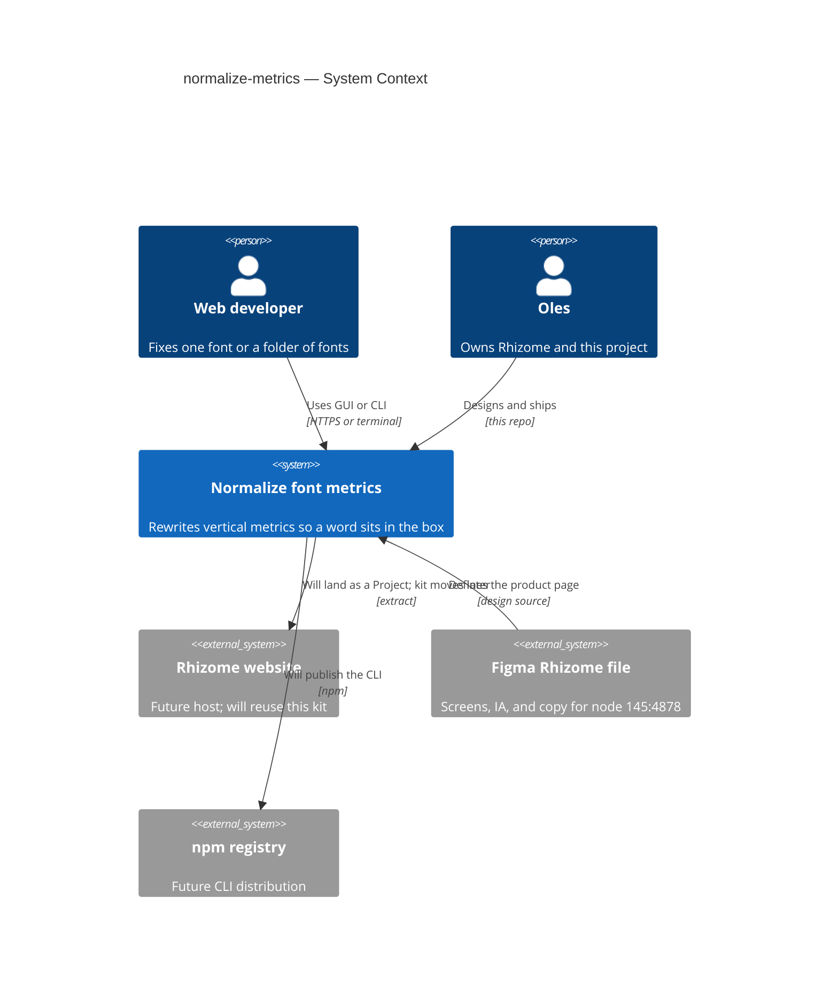
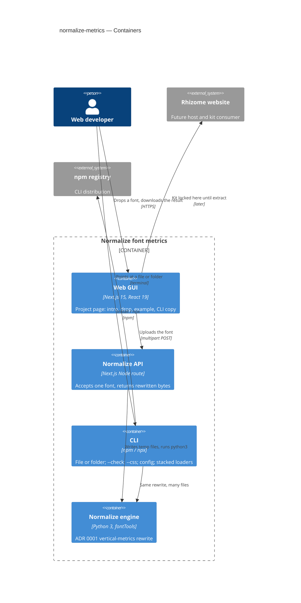
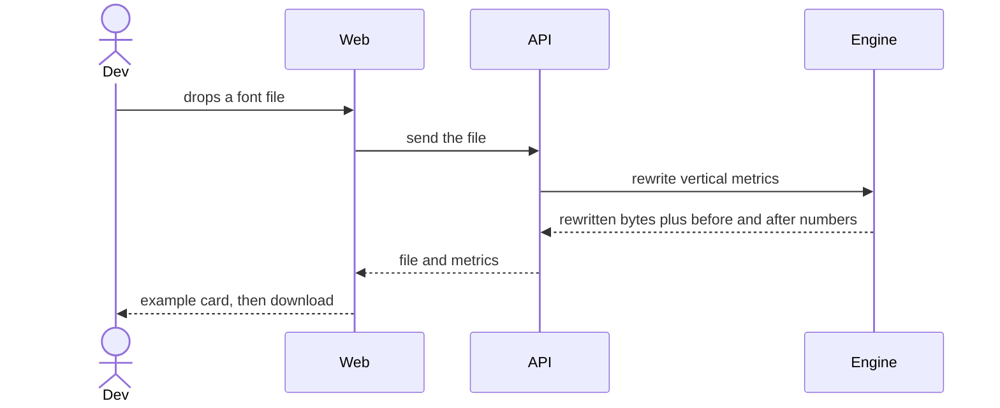

# Software Architecture Document — normalize-metrics

There is no `spec.md` yet. This SAD is standalone. It records two product facts (Rhizome project lock; GUI + CLI) plus the architecture already in the repo and ADRs 0001–0003. Screen, IA, and public copy live in Figma; the rewrite formula lives in ADR 0001, with used line-height leftover in ADR 0003.

## 1. Introduction and goals

**Intent.** Normalize font metrics is a Rhizome **project**: a page on the future Oles Gergun website, and also the first place the Rhizome UI kit is built. It rewrites a font’s vertical metrics so a one-word label sits in the middle of an equal-`padding-block` button. Outlines, rhythm, and the look of the face stay unchanged. People reach that rewrite through a GUI or a CLI. The CLI can also write the same box as CSS metric overrides and leave the file alone.

**Top-3 quality goals (1-liners; full scenarios in §10):**

1. Optical correctness — cap-center offset on the macOS/hhea path goes to ~0 (ADR 0001).
2. Surface lockstep — GUI and CLI run the same engine; public copy does not split the product.
3. Kit extractability — Rhizome primitives stay separable from the measurement `example`, even while everything lives in this repo.

**Stakeholders.**

| Role | Interest | Sign-off owner? |
|---|---|---|
| Oles (Rhizome owner) | Product, kit, copy, both surfaces | Yes |
| Web developer | Drops a file or runs the CLI on a folder | No |
| Type designer | Optional later surface on the same engine | No |

## 2. Constraints

**Technical.**
- TypeScript, Next.js 15, React 19 — App Router. The GUI page is a client component; `/api/normalize` is a Node route.
- Python 3 + fontTools — `lib/engine.py` is the only rewrite. The API and the CLI wrap it. pip is not a public install (ADR 0002).
- No datastore. Normalize is a request in, bytes out. Subscribe is local UI state in v1.
- Static fonts in this repo: KTF Techne (UI), Univers Next Typewriter Pro (mono). Tokens live in `app/globals.css`.

**Organisational.**
- This app is a **project** of the future Rhizome website (`@ / Projects / …` in Figma).
- Components and styles from here are the backbone of that site’s front-end.
- Most of the UI kit — tokens, type, button, input, drop zone, tabs, shell, icons, subscribe — is Rhizome. The measurement `example` (bands, pill, before/after) is this project’s only feature-specific piece.
- **For now everything is locked in this repo.** No shared Rhizome package, no extraction, no second design-system repo. The future site will take the kit from here.

**Conventions.**
- Public copy structure: one intro (problem + CSS default + what the rewrite does), then surface-specific how-to. Canonical wording in ADR 0002; screens in Figma.
- Never overwrite a font by default. CLI writes a sibling copy; `--in-place` is opt-in.
- `--css` writes `@font-face` overrides for the original files into `style.css`, or into the path that follows the flag. It does not write a font. Those descriptors must not be applied to an already rewritten file.
- One extra-rule (ADR 0001 option 2). Not a v1 config flag.

**Regulatory / external.**
- Rewriting a licensed font and redistributing the result may violate the EULA. The tool does not legalize the file. Warn once per run (ADR 0001, 0002).
- No auth, no user datastore, no analytics contract in v1.

## 3. Context and scope

Normalize font metrics is one Rhizome project. A web developer uses the GUI to prove a single face, or the CLI to fix a folder and fail CI. CSS `text-box: trim-both cap alphabetic` is the no-file alternative (Baseline-complete when Firefox shipped it on 18 August 2026). The CLI `--css` file is the other no-file path: `ascent-override`, `descent-override`, and `line-gap-override` set to the ADR 0001 / 0003 box, as percentages of the em. Those descriptors center the cap inside the line box and leave the file unchanged. `text-box` trims to the cap and the baseline. The product exists for the default, still-untrimmed box, and the rewrite remains the fix for every consumer of that box.

Product logic, IA, and visual design are in Figma: [Rhizome — Normalize font metrics](https://www.figma.com/design/bF9a8QlbdvcuiRNl7XlrPf/Rhizome?node-id=145-4878&m=dev) (node `145:4878`). That frame is Introduction → GUI (drop, measurements, download, three tried fonts) → CLI (npm / npx / `--check`).

<!-- brownfield: Next.js GUI + Python engine + CLI exist. Rhizome site is future, not in this repo. -->

**External systems (in / out):**

| Actor or system | Type | Interaction |
|---|---|---|
| Web developer | Person | Drops a font on the GUI, or runs the CLI on a file or folder |
| Oles | Person | Owns Rhizome, the kit, and both surfaces |
| Rhizome website | System (future, external) | Will host this page as a Project and reuse the locked kit |
| Figma (Rhizome file) | System (external) | Source of screens, IA, and public copy |
| npm registry | System (external) | Future CLI install (`normalize-metrics` / `npx`) |

**C4 Context (L1):**



## 4. Solution strategy

**Target surfaces.** `web-frontend` and `cli`. The Next.js `/api/normalize` route is a container inside the web deployable, not its own surface. UI architecture for the web surface: Next.js App Router, one client page, CSS tokens in `app/globals.css`, no extracted component library yet.

**Top strategic choices (the seeds for ADRs):**

1. **Lock the Rhizome kit in this repo until the website exists** — this project is the first Rhizome front-end. Tokens, type, and primitives stay here. The measurement `example` does not travel with the kit. Extraction is a later move, not a v1 package.

2. **Ship a GUI and a CLI on one engine** — ADR 0002. GUI is the proof (drop, measure, download). CLI is the batch / CI path (file or folder of `.otf` / `.ttf` / `.woff` / `.woff2`). Both call `lib/engine.py`. Figma node `145:4878` is the product logic for both sections of the page.

3. **Rewrite vertical metrics only, cap-centered** — ADR 0001. Descender-symmetric extra, typo = hhea, `USE_TYPO_METRICS` on, Win bbox envelope. Outlines, UPM, and horizontal metrics stay untouched. CSS trim is acknowledged in the intro and is not the product. **Spend original used line-height before growing** — ADR 0003. `lineGap` is leftover `oldAscent + |oldDescent| + oldLineGap − content`, not a constant 0.

4. **npm is the CLI front door** — `npx` / `npm i -g` / a repo devDependency. Python is an implementation detail. Config is `include` / `exclude` / `outDir` / `suffix`. `--check` and `--dry-run` write nothing. `--css` writes `@font-face` rules for the measured files into `style.css` unless a path follows the flag, and does not write a font. Files that share a family, weight, style, and box become one rule with several `src` values. Percentages are the engine’s after box divided by UPM: `ascent`, `|descent|`, `lineGap`. `src` points at the original file.

Each later decision should trace to one of these. A second extra-rule flag, a pip install, or extracting Rhizome in this repo would contradict 1–4. `--css` does not: it prints the same target box. ADR 0003 is not a second extra-rule; it only assigns `lineGap`.

## 5. Building block view

Layered wrappers around one domain function. The GUI and the CLI are ports. The Next.js API is a process-local port so the browser never runs fontTools. There is no persistence layer.

**Internal decomposition:**

```
normalize-metrics/
├── app/
│   ├── globals.css          Rhizome tokens + primitives (locked here)
│   ├── layout.tsx           document shell
│   ├── page.tsx             GUI project page
│   └── api/normalize/       Node port → Python engine
├── lib/engine.py    ADR 0001 rewrite (shared)
├── cli/                     npm / npx port → same engine
├── bin/normalize-metrics.js npm bin
├── public/                  icons + UI font files
└── docs/
    ├── sad.md
    └── adr/
```

**Kit vs example.** Rhizome (will move to the website): color/spacing tokens, KTF Techne, Univers Next Typewriter Pro, button, input, drop zone, tabs, shell, icons, subscribe, breadcrumb, page chrome. This project only: the Figma `example` — the 600px measurement card, leftover bands, before/after toggle, and the three tried fonts (Unica77, America, Ritma).

**C4 Container (L2):**



## 6. Runtime view

**Critical flow 1: GUI normalize one font**



**Critical flow 2: CLI folder or check**

```mermaid
sequenceDiagram
    actor Dev
    participant CLI
    participant Engine
    Dev->>CLI: file, folder, --check, or --css
    CLI->>CLI: find otf ttf woff woff2
    loop each matching font
        CLI->>Engine: rewrite or measure
        Engine-->>CLI: metrics and optional rewritten bytes
    end
    alt write
        CLI-->>Dev: sibling copies next to originals
    else check
        CLI-->>Dev: report and non-zero exit if any font is still off
    else css
        CLI-->>Dev: stylesheet of metric overrides; fonts unchanged
    end
```

## 7. Deployment view

<!-- N/A: S-size, reuses a single Next.js app. No new infra. CLI is an npm package, not a service. -->

v1 is one Next.js deployable plus a future npm CLI. No replicas, no worker, no datastore. The Python binary must be on the API host. Scaling is “one font per request,” 12 MB cap on the current route.

**Monitoring:**
- Metrics — none specified (no spec §6).
- Alerts — none in v1.
- Tracing — none in v1.

**Scaling thresholds:**
- Comfortable as a single Next.js instance for interactive single-file use.
- Folder normalize is a local CLI job, not a server job.

## 8. Crosscutting concepts

| Concept | Convention | Where defined |
|---|---|---|
| Logging | stderr from Python; HTTP JSON `{ error }` from the route | `app/api/normalize/route.ts` |
| Authentication | None in v1 | — |
| Error handling | Refuse empty/corrupt files; skip variable fonts and TTC in CLI v1 with a one-line reason | ADR 0001, 0002 |
| ID strategy | None — no stored entities | — |
| Internationalisation | English only | Figma + ADR 0002 copy |
| Observability | Preview is the proof; CLI `--dry-run` / `--check` is the report | ADR 0002 |
| UI kit | Rhizome tokens and primitives, locked in this repo | §2, `app/globals.css` |
| License | EULA reminder once per run; rewrite is not a license | ADR 0001 |

## 9. Architecture decisions

| # | Title | Status | Section |
|---|---|---|---|
| 0001 | Make the line box symmetric around cap-height | Accepted | §4 |
| 0002 | Ship a GUI and a CLI on one normalize engine | Accepted | §4 |
| 0003 | Spend leading before growing the line box | Accepted | §4 |

ADR files live under `docs/adr/NNNN-<title>.md`.

The Rhizome kit lock is a §4 pillar, not a third ADR: it is reversible by extraction later, and it is stated here so the future website does not invent a second kit.

## 10. Quality requirements

No `spec.md` §6 NFR yet. Scenarios are qualitative from ADRs 0001–0003 and Figma node `145:4878`. Do not invent latency or availability numbers.

**QG-1. Optical correctness**
- **When:** a static TTF/OTF/WOFF/WOFF2 is rewritten.
- **Then:** leftover above cap-height equals leftover below the baseline on the hhea path; outlines are unchanged. If original `ascent + |descent| + lineGap` already covers `cap + 2 × extra`, used `line-height: normal` does not grow (ADR 0003).
- **How verify:** GUI before/after `example` and Text sample; research set in ADR 0001 (Areal, Techne, Akkurat, DIN); Ritma/Unica/America in ADR 0003; CLI `--dry-run` offset column.

**QG-2. Surface lockstep**
- **When:** the same file is sent through the GUI and the CLI.
- **Then:** the rewritten tables match; public intro copy is shared, not GUI-only.
- **How verify:** both wrappers call `lib/engine.py`; `--css` percentages equal `after.ascent / upm`, `|after.descent| / upm`, and `after.lineGap / upm`; page sections follow Figma Introduction / GUI / CLI.

**QG-3. Kit extractability**
- **When:** the Rhizome website is built.
- **Then:** tokens, type, and primitives can move; the measurement `example` stays with this project.
- **How verify:** `example` (bands, pill, toggle) is the only feature-specific UI; everything else is named as Rhizome in §5.

## 11. Risks and technical debt

| Risk / debt | Severity | Mitigation | Owner |
|---|---|---|---|
| Licensed fonts rewritten and redistributed | High | Warn once per run; do not claim the file is relicensed | Oles |
| GUI and CLI drift (second extra-rule, different copy) | High | One engine; Figma + ADR 0002 as the wording contract | Oles |
| Kit extraction later is a multi-day move | Medium | Keep `example` isolated; do not publish a Rhizome package in v1 | Oles |
| Python must exist on the API host | Medium | Document the runtime; hide pip from users | Oles |
| `--check` will fail existing kits the first time | Medium | Expected; document in CLI copy | Oles |
| `--css` descriptors applied to an already rewritten file | Low | `src` points at the original; the flag does not write a font | Oles |
| Variable fonts and TTC skipped in v1 | Low | One-line skip reason; ADR 0001 out-of-scope | Oles |
| TextExample `--lead` is not table `lineGap` | Low | ADR 0003 spends file used height only; do not chase UA `normal` | Oles |
| No spec.md — quality numbers are qualitative | Open question | Write `spec.md` before treating §10 as numeric NFRs | Oles |

**Accepted debt (acceptable in v1, plan to fix later):**
- CLI ships in this repo (`cli/`, `bin/`); npm publish is still future.
- Subscribe does not persist.
- Rhizome website and npm publish do not exist yet.
- No curl / standalone binary for people without Node.

## 12. Glossary

| Term | Meaning |
|---|---|
| Rhizome | Oles Gergun’s future website and the UI kit it will use. This app is one of its Projects. |
| Project | A public tool page under Rhizome (`@ / Projects / …`). This feature is one. |
| UI kit | Rhizome primitives and tokens. Locked in this repo for now. Does not include `example`. |
| example | Feature-specific measurement card: leftover bands, pill, before/after. Stays with this project. |
| Line box | CSS content area from the font’s ascent and descent (hhea on macOS). Not the ink of H. |
| Used line-height | `ascent + \|descent\| + lineGap` — what `line-height: normal` uses on the hhea/typo path. ADR 0003 spends this before growing. |
| Leading (`--lead`) | Extra used height outside the content area. Pink/purple bands in TextExample sit inside the content area; white between stacked bands is this lead. Table `lineGap` is the file part; a UA can add more. |
| Cap-center offset | `((ascent − H.yMax) − \|descent\|) / 2`, per mille of em. Zero means H is vertically centered. |
| Default case | Untrimmed `text-box`. What most type ramps and kits were written for. Why this product exists. |
| Engine | `lib/engine.py` — the 0001 rewrite plus 0003 `lineGap`. GUI API and CLI are wrappers. |
| Metric overrides | `@font-face` descriptors `ascent-override`, `descent-override`, `line-gap-override`. CLI `--css` writes them from the after box, as percentages of the em. They apply only where that stylesheet is used, and they point at the original file. |
| Tried fonts | Unica77 (Lineto), America (Grilli Type), Ritma (British Standard Type) — Figma GUI examples. |
